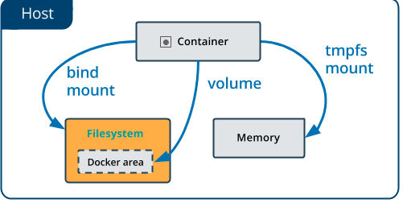
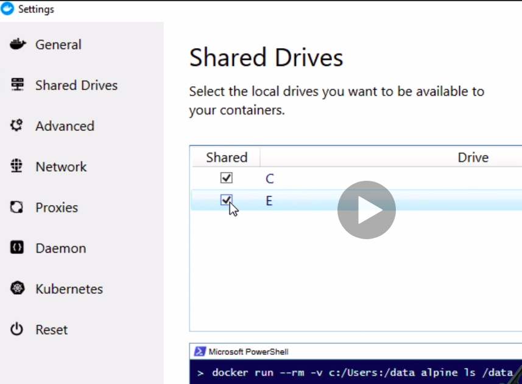
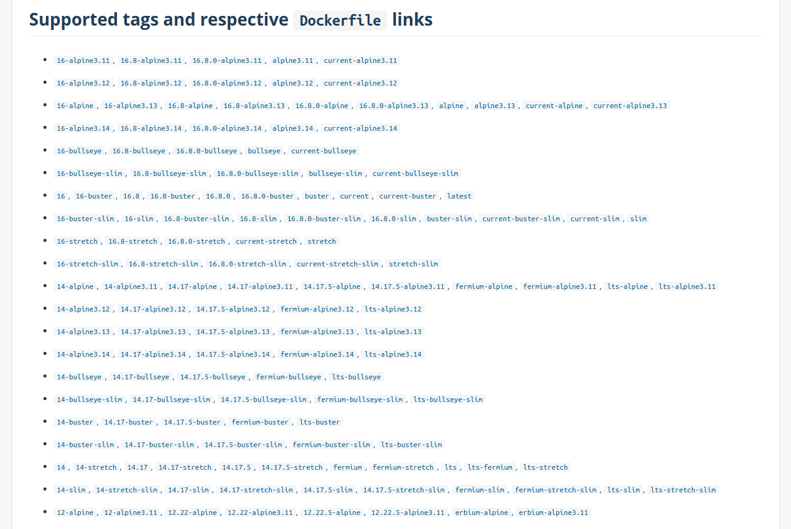
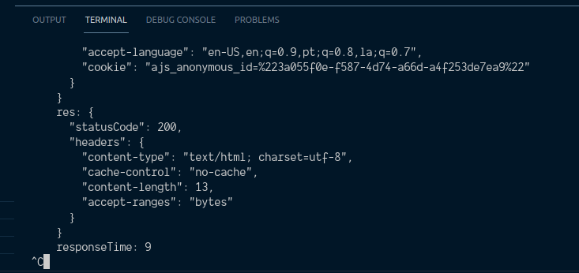
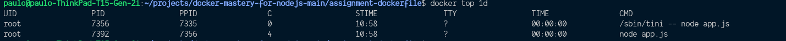
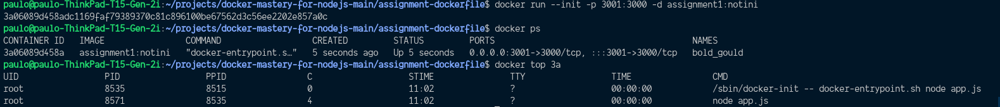
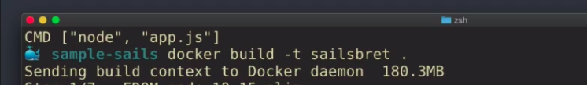
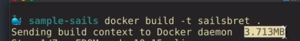
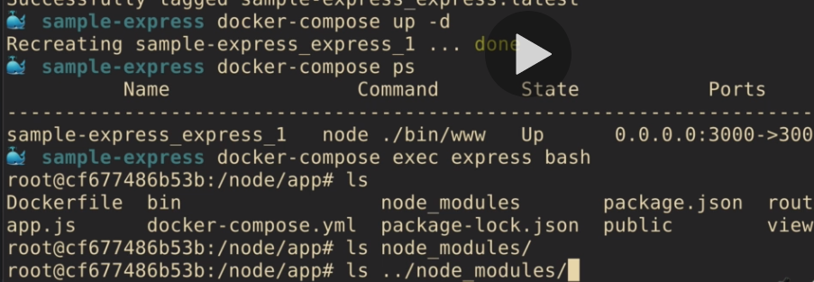

# Docker Mastery for Node.js Projects From a Docker Captain

This repo is for use in my Udemy Course https://www.bretfisher.com/docker-mastery-for-nodejs

# My Notes

## [Alpine](https://wiki.alpinelinux.org/wiki/Alpine_Linux_package_management)

Because Alpine Linux is designed to run from RAM, package management involves two phases:

- Installing / Upgrading / Deleting packages on a running system.
- Restoring a system to a previously configured state (e.g. after reboot), including all previously installed packages and locally modified configuration files. (RAM-Based Installs Only)
- `apk` is the tool used to install, upgrade, or delete software on a running system.
- `lbu` is the tool used to capture the data necessary to restore a system to a previously configured state.

## Docker Compose

- `docker-compose` CLI is a substitute for docker CLI
- `docker-compose` CLI was not designed for production, instead it was designed around developer workflows
- `docker-compose.yml` is a standard convention for name definition
- many `docker` commands == `docker-compose`
- `docker-compose` CLI and YAML versions differ

### YAML

yml is the extension for YAML, a common configuration file format, it uses:

- `:` for key/value pairs
- `-` for lists
- only spaces, no tabs

i.e:

```yml
version: "2.0"

services: # services is one or more container based on a single image
  web:
    image: sample-01 # the image we want it to make when we build this directory
    build: . # this is to where build to, . is a shorthand for the current directory
    ports: # ports is a list because we can have many ports published
      - "3000:3000"
```

- **Compose YAML v2 vs v3** - v2 focus on single-node, dev/test and v3 focus on multi-node and orchestration, so if not using Swarm, Kubernetes, prefer v2 - [Reference](https://github.com/docker/docker.github.io/pull/7593)
- [Online YAML Validator](https://codebeautify.org/yaml-validator)
- `v2` only: `depends_on`, hardware specific
- [v2 reference](https://docs.docker.com/compose/compose-file/compose-versioning/#version-21)

### Installing docker-compose on Linux

```bash
pip install docker-compose
```

### docker-compose up

this command will do everything it need to make the docker image live, it includes:

- build/pull image(s) if missing
- create volume / network / container(s)
- starts container(s) in foreground (`docker-compose up -d` to detach to background)
- `--build` to always build
- If you build a container, bring it up, then stop it, edit the Dockerfile, and up again, the changes on the Dockerfile won't reflect. And that's because we didn't build the image, because it's already built! So we force it to build with: `docker-compose up -d --build`

### docker-compose down

this command will do everything to stop:

- stop and delete network / container(s) (it preserves data)
- use `-v` to delete volumes (data), so you can use `docker-compose down -v`, to do a clean uninstall of everything including data
- it won't delete the images by default, you have to use `docker-compose down --rmi` to do so. Check for `docker-compose down --help` for more commands

### docker-compose build

- just build/rebuild image(s)
- you can use `docker-compose build --no-cache` to build a image from scratch (don't need technically to use `docker-compose down --rmi`)

### docker-compose CLI basics

- Commands takes "service" name as option (not the container or image name), it's just for building images and not messing around with `up` or `down`
- `docker-compose build` - just build/rebuild image(s)
- `docker-compose stop` - just stop containers, don't delete
- `docker-compose ps` - list services, different from `docker ps`, it shows stopped and running containers, and in an easier format, will show ports open, and which errors might have happenend if a container has stopped
- `docker-compose push` - push all the images in your compose file up to the registry
- `docker-compose logs` - see all logs for all of the containers running or pass the name of the service to filter, you can use `docker-compose logs -f` to follow the logs, and let the output streamming
- `docker-compose exec` - Execute commands inside running containers (it takes the services name, i.e `docker-compose exec web sh`) (it does require the container to be running already)
- `docker-compose run` - Start a new container and run command / shell (it does not require the container to be running already)

### Docker build workflow

- If we want some package to be available on the image, we can run a command to use it's package manager to install it, we can edit `Dockerfile` and add the `RUN` command:

```yml
# we want curl to be installed on the image
RUN apk add --update curl
```

### Ports

How ports publishing works:

- The left side is what the host, your machine will use.
- The right side is what is used in the container.

So, given a node application who start a express server in port 3000, you can:

```yml
"3000:3000" # You can access https://localhost:3000 from your browser and see the application
"8080:3000" # You can access https://localhost:8080 from your browser and see the application
"3000:8080" # You will get error, because the docker is running anything on port 8080
```

### Docker-compose volumes

- If we create a named volume, our data is kept when we run `docker-compose down`

```yml
#...
volumes:
  #GOOD: created a named volume so our data is kept between docker-compose ups
  - db:/var/lib/mysql
#...
```

### [Bind-mounting](https://docs.docker.com/storage/bind-mounts/)

When you use a bind mount, a file or directory on the host machine is mounted into a container. The file or directory is referenced by its absolute path on the host machine. By contrast, when you use a volume, a new directory is created within Docker’s storage directory on the host machine, and Docker manages that directory’s contents.

The file or directory does not need to exist on the Docker host already. It is created on demand if it does not yet exist. Bind mounts are very performant, but they rely on the host machine’s filesystem having a specific directory structure available. If you are developing new Docker applications, consider using named volumes instead. You can’t use Docker CLI commands to directly manage bind mounts.



- Don't use host file paths: Use relative paths to bind-mount instead of absolute, (it's fine for larger app to use `../` to reference other folders)

```yml
#...
volumes:
  #GOOD
  - db:/var/lib/mysql
  #BAD
  - /my/path/on/host:/var/lib/mysql
#...
```

- Don't bind-mount databases (Because they won't work well across the OS boundary, specially if you're on Windows or Mac), it's not a problem for linux users because it's the same filesystem with symlinking, but for other OS they can be really slow
- For local dev only, don't need to copy in code (don't need to keep using `docker-compose build` every time code changes, because we just want to develop and start node, we just need to rebuild if we change dependencies, like `package.json`)
- Windows: enable drive permission for sharing the drive letter where your code is at (uncheck and check again if facing issues), also remember that permissions works differently for linux and windows



- [Reference](https://www.docker.com/blog/user-guided-caching-in-docker-for-mac/) for caching tweaks around bind-mounting on windows and mac

You can use the `delegated` flag to tell docker that it's okay for the container file IO, to get ahead of the host, that means (not every file IO transaction needs to be identical on host to container, which means the container wins out, and the host catch up later). Handy when doing lots of writes, like npm installs, or ts convertion

```yml
volumes:
  - ./content:/var/lib/ghost/content:delegated
```

- [Windows caveats](https://www.udemy.com/course/docker-mastery-for-nodejs/learn/lecture/13970470#content) for when suffering very slow development

### Docker-compose don'ts

- Unnecessary `alias` and `container_name` (instead, just name our service what you plan to use in DNS for cross container communications)
- Legacy: `expose` and `links`, don't need to expose anymore, because all containers on the same network are already exposed to each other (If you don't want them to see each other, just put them on different networks). And links don't need anymore because we can use `networks` to connect them.
- Don't set defaults

## Dockerfile

- [Best practices](https://docs.docker.com/develop/develop-images/dockerfile_best-practices/)
- Remember that line order is important, because it builds naturally from top to bottom.
- Also remember, if you have layers that don't change often, let them at the top of the file, otherwise, it won't benefit of caching.
- [Dockerfile reference](https://docs.docker.com/engine/reference/builder/#dockerfile-file)

_Follow this [Assignment](assignment-dockerfile) for a reference on building Dockerfile without docker-compose_

### FROM

- This is the raw machine you will be using, usually it will come with `node` and `npm` installed, or even `yarn`, so prefer machines that comes with your core application installed.
- Tip: Prefer even versions of `node`, because even are stable releases and odd are more experimental, all LTS (Long Term Support) versions are even. So, don't use :latest tag.
- Check the [Releases](https://nodejs.org/en/about/releases/) page for the latest LTS Version
- On [Docker Hub](https://hub.docker.com/_/node) all oficial images use `Debian` as their base image, which means we get `apt get` package manager, core utilities like `openssl`, and `bash` shell. These `Debian` images can be big for convenience, so focus on `Alpine` for most new projects, and just use `Debian` if migrating from a pre-container world, and then consider moving to `Alpine` later. Because `Alpine` is a very small base image, that has only the minimal tools for `node` to get started.
- Caveats: `Debian` distributions will have more base OS packages that might be needed for some `npm` packages depencencies, with `Alpine` we need to make sure its supports those packages, be aware about edge cases where we won't have support in `Alpine` Package Manager



- All this images are what we can specify on the `FROM` line, so we can for example:

```Dockerfile
FROM node:16
# Because there is a single 16 version

FROM node:16-alpine
# Chooose alpine for a much smaller variant, (About 8x less)

# Or
FROM node:16-alpine3.11
# ...and so on
```

- Also you will notice some `slim`, versions, they are smaller versions of debian, it's not recommend to use it, unless you have a high reason to do so, because that's what `Alpine` is for, and it's the industry standard for smaller images. Altough, if you can't use `Alpine`, might worth to check for `slim` versions.
- `onbuild` images are old, don't use it, because are problematic due to the fact your `Dockerfile` will execute commands from the image's `Dockerfile`, before executing from yours.
- `Alpine` is more secure focuses due to the fact there are less out-of-the-box, that means less pottential risk, but be aware that is falls on [CVE (Common Vulnerability) scanning](https://kubedex.com/follow-up-container-scanning-comparison/)
- Worth noting that `Debian`/`Ubuntu` images are not that huge, it's about `~100MB`, so if the convenience worth, go for it and don't worry with space.
- A tip for production is to use patch images, so you guarantee they will work as expected. i.e. `node:10.15.3-alpine3.11-slim`

### COPY

- most of times you will use `COPY`, it copies from one place to another,

### ADD

- `ADD` does many stuff, like download files from the internet, untar any files it sees in local directory, never use `ADD` for copying files (it can do it, but you shouldn't), for copying use `COPY` instead!

### WORKDIR

- You shoudn't use `cd` or `mkdir` inside `Dockerfile`, instead use `WORKDIR` that does both.
- it will make the directory if it's not there

_One caveat, is that if you need specific permissions on a directory when it's created mkdir might be better_

### CMD

- Use `node` to run your commands, not `npm`:

```Dockerfile
CMD ["node", "./bin/www"]
```

- One of the reason, i's because `npm` requires another application to run, that means, if you run with `npm`, instead of having just `node` running, you will have `npm` running, and `node` as a subprocess, and that adds complexity and an unnecessary layer
- Other reason, is not literal on what is happening, it's better when `Dockerfile` tells exactly what is happening when it launches, and when it's something like `npm start` that means `npm` will arbitrary call another command, so is not literal on it's intention, so it's harder to debug.
- Other reason, `npm` doesn't work well as an init process, that's because in Linux and containers, there's always a main process that everything launches from, so, if we start something that launches something else, we get sort of tree structures, and one main problem would be handle the signal termination. `npm` does not pass signals correctly to `node`, so, it tends to just improperly shut down the container. In this case, keeping `node` as the main process is simpler and allows to use **Direct Singnaling**.

### Dockerfile for a custom image

- We can provide custom node images for OS that are not the officials, like Debian or Alpine, for this we can search docker hub for other images we want, i.e Centos, Ubuntu, Red Hat, etc...

_Follow this [CentOS Dockerfile](centos-node/Dockerfile) for reference_

### User

- Note that on official images, the apps will be running as root in the container (root in container is not the same as host, because containers are restricted from the rest of the system).
- But even they not being the same, we want to reduce security risk inside containers, a way of doing this is run apps in the container as a non root user. So if someone manages to break trough the app, they wouldn't even be root in the container, just a standard user account with very little privileges.
- A good news is that the official node image has a Node user built in, it's just not enabled by default, that's because of the various errors that can occur related to permission, commands like `apt-get` or `yum`, or `npm install -g` , so you need to consider that. Advice is always try to enable least privilege, so you will want to enable the least privileged user after the `apt`/`apk` commands or `npm i -g`, and before the `npm i`.
- Problems that might happen when using node user instead of root, is if your application expect to write or install while your app is running.
- Be aware that only `RUN`, `CMD` and `ENTRYPOINT` commands will behave as the `node` user, everything else will be as `root`, so you might found problems on directory and file specific commands like `WORKDIR`, that's why is important to remember to apply permission to the node user when creating directories.
- Once we elect the node user, any `docker compose exec` will use the node user by default, if we need to change that, we can use the -u root with any exec command. Useful for adding packages without denying access.
- [Diferences between chmod and chwon](https://www.unixtutorial.org/difference-between-chmod-and-chown/)
- [USER reference](https://docs.docker.com/engine/reference/builder/#user)
- [COPY reference](https://docs.docker.com/engine/reference/builder/#copy)

```Dockerfile
FROM node:10-slim

EXPOSE 3000

WORKDIR /node

COPY package*.json ./

# Since Docker has already created the Node user in the upstream from image, we just need to enable it with this command in Dockerfile:
USER node

# Creating directory and setting permission to the node user and group, so we can do things like `run npm install`, write cache files, etc...
RUN mkdir app && chown -R node:node .

# Now we can install as the node user
RUN npm install && npm cache clean --force

WORKDIR /node/app

# We could do:
# RUN chown -R node:node .
# instead, but the chown command adds another layer to the image without deleting the previous layers.
# That means, that the final container image contains both layers. Thus, the size of the container adds the size of both folders: the original working directory for the root user, and the second working directory with permissions for the normal user.
COPY --chown=node:node . .
# when using the --chown flag, it avoids the extra layer, so it will result in smaller size of the image.

CMD ["node", "app.js"]
```

### How cache busting works

- Whenever a line is changed on the Dockerfile, that line, and the line below it, will have to be rebuilt. That's the normal behaviour, but it's good to avoid it whenever is not necessary.
- Like for example if Dockerfile expose this port, and it never change, put them at the top of the file, so it will be cached.

```Dockerfile
EXPOSE 3000
```

### Optimization

- Avoid copying all the source files before npm install, because any time a source file change, it will bust the run line for npm install and have to rerun that line every single time it copies the source files. And we definitely don't want that.

```Dockerfile
FROM node:10-alpine
EXPOSE 3000
WORKDIR /usr/src/app

# Avoid that:
COPY . .
RUN npm install && npm cache clean --force

CMD ["node", "./bin/www"]
```

- To avoid that we usually just have a copy for package.json and package-lock.json, and then we run npm install, and then we copy in . . (that means everything else). This will save a lot of time.
- `npm install --production` will install only the production dependencies, and not the dev dependencies.
- use `npm ci` to build from the package-lock.json file, instead of using the `package.json`, also it will build faster. [Sample at](multi-stage-deps/Dockerfile)

### Tips

- We can copy `package-lock.json` with `*` which means it will copy if is there, but won't fail if it's not there.
- This is good in case `package-lock.json` is auto generated, and we don't want to copy it.
- [Git Ignore Generator](https://www.toptal.com/developers/gitignore)
- [Advanced Node Project Structure](https://blog.risingstack.com/node-js-project-structure-tutorial-node-js-at-scale/)
- [dockerignore examples](https://www.cloudbees.com/blog/leveraging-the-dockerignore-file-to-create-smaller-images)

```Dockerfile
# without the * it would fail the build in case it's doesn't exist
COPY package.json package-lock.json* ./
```

- Keep only one `apt-get` or `yum` per Dockerfile, and put it higher in the Dockerfile. Also remember to pin versions of packages you're installing.
- Also keep all installs together, or cache busting will be against you.

```Dockerfile
FROM node:10-alpine
EXPOSE 3000

RUN apt-get update && apt-get install curl

WORKDIR /usr/src/app

COPY package.json package-lock.json* ./

RUN npm install && npm cache clean --force

# Don't do this, the correct would be to put at the top with the curl install
# Because if we do that, and then change anything in package.json, it will bust only the cache for httping, but without apt-get being updated, because the lines before were cache busted.
RUN apt-get install httping

COPY . .

CMD ["node", "./bin/www"]
```

### Dockerfile Documentation

- FROM stage, document why it's needed.
- COPY - don't document (it's obvious)
- RUN - when it's complex, document it.
- RUN `npm config list` (to log out the npm config)
- Add LABELS
- - Labels has OCI standards (LABEL org.opencontainers.image.<key>)
- - Can accept ARG to be dynamic, (like build date or git commit)
- - [Sample](dockerfile-labels/Dockerfile)
- - [Spec](https://github.com/opencontainers/image-spec/blob/main/annotations.md)
- - [Reference](https://docs.docker.com/engine/reference/builder/#label)
- - [Reference Objects](https://docs.docker.com/config/labels-custom-metadata/)
- Document compose file
- - Document overrides (like custom CMD, or yml overrides)
- - Document why a volume is needed
- - Template blocks at top

### Tests

- `RUN npm test` in a specific build stage
- Also you can run linting commands
- Only run unit tests in build (Other tests are more a job for docker-compose)
- Don't run test by default
- Locally, you should be able to: run `docker-compose run node npm test`
- [Sample](multi-stage-test/Dockerfile)
- [Unit test ref](https://blog.risingstack.com/node-hero-node-js-unit-testing-tutorial/)
- [docker hub advanced builds](https://docs.docker.com/docker-hub/builds/advanced/)
- If you run tests they will got cached, if you want to force run again without cache, you can use:

```bash
docker build -t testnode --target=teste --no-cache .
```

### Security Scanning

- in the test stage or in a dedicated stage
- or run once image is built with CI
- only report at first, no failing (most images have at least one CVE vulnerability)
- Consider `RUN npm audit` - a great feature of npm that will make sure that we don't have any known security vulnerabilities with our dependencies.
- [Reference](multi-stage-scanning/Dockerfile)

```Dockerfile
## Stage 5 (security scanning and audit)
FROM test as audit

RUN npm audit

# aqua microscanner, which needs a token for API access
# note this isn't super secret, so we'll use an ARG here
# https://github.com/aquasecurity/microscanner
ARG MICROSCANNER_TOKEN
ADD https://get.aquasec.com/microscanner /
RUN chmod +x /microscanner
RUN apk add --no-cache ca-certificates && update-ca-certificates
RUN /microscanner $MICROSCANNER_TOKEN --continue-on-failure
```

- [Reference latest confusion](https://blog.container-solutions.com/docker-latest-confusion)
- [Reference Docker scanning](https://sysdig.com/blog/docker-image-scanning/)
- [Reference Scanners comparison](https://kubedex.com/follow-up-container-scanning-comparison/)
- [Reference Scanning](https://kubedex.com/container-scanning/)
- [Reference npm best practices](https://snyk.io/blog/ten-npm-security-best-practices/)

### CI / CD Automated builds

- Have CI builds on important branches (master, release, etc)
- Push to registry once build / tests pass (automatic)
- Lint Dockerfile and Compose/Stack files (YAML Linting, Docker linting)
- Use `docker-compose run` or `--exit-code-from` for proper exit codes (with exit code from you know which container returned the error)
- Dockerhub can also work as a CI solution
- Also remember that `<name>:latest` is only a convention, use it for local easy acess to current release, usually it's a good idea to follow your release version or semver (so you don't repeat tags)

- [Reference CI exit codes](https://stackoverflow.com/questions/29568352/using-docker-compose-with-ci-how-to-deal-with-exit-codes-and-daemonized-linked)
- [Reference Hadolinter](https://github.com/hadolint/hadolint)
- [Reference Dockerfilelint](https://github.com/replicatedhq/dockerfilelint)
- [Reference Dockerhub](https://docs.docker.com/docker-hub/builds/automated-testing/)

### Dockerfile Healthchecks

- Always include `HEALTCHECK`
- Docker run and docker-compose: info only
- Docker Swarm: key for uptime and rolling updates
- Note that we want healthchecks to be isolated and not depend on other services (ie databases)

- [Sample](healthchecks/Dockerfile)

```Dockerfile
# option 1, using curl to GET the default app url
# NOTE: ensure curl is installed in image
HEALTHCHECK --interval=5m --timeout=3s \
  CMD curl -f http://localhost/ || exit 1

# option 2, using curl to GET a custom url with app logic
# NOTE: ensure curl is installed in image
HEALTHCHECK CMD curl -f http://localhost/healthz || exit 1

# option 3, a custom code healthcheck that could
# do a lot more things then a simple curl
# or simply avoid needing curl to begin with
HEALTHCHECK --interval=30s CMD node hc.js
```

### Node process management

- In Docker containers we don't need to use tools for managing processes, like `nodemon`, `forever`, `pm2`, etc... Docker is gonna do it for us.
  -- Altough, we can use nodemon for dev as file watcher.
- Docker can manage the whole process, it can start, stop, pause, restart and health check, to restart the process if is not healthy.
- Docker manages multiple "replicas" of the same process, so if we have a process that is running, and we restart it, it will restart all the replicas.

### Process Identifier - PID

- PID 1 is the first process in a system (or container) (AKA init)
- Init process has two jobs: reap zombie processes and pass signals to sub-processes (like shutdown).
- Zombie process is not a issue with node, usually we're just going to have one node process and subprocesses.
- Docker uses Linux signals to stop app (SIGINT, SIGTERM, SIGKILL) and to restart it (SIGHUP).
  -- We never want to deal with SIGKILL, because it's killing the container, without having a chance to stop it or respond.
  -- SIGINT is used when we ctrl+c
  -- SIGTERM is used when we do a docker container stop
  -- The problem: `npm` does not handle this signals at all, that's why we should use `node` instead of `npm`, it doesn't handle by default but we can add code to handle it.
- Docker provides a init `PID 1` replacement option (it's called [tini](https://github.com/krallin/tini)), but this is a sort of backup. Just pass `--init` flag option to `docker run`

### Proper Node shutdown options

- Temp: use --init to fix ctrl+c issue for now. (it will use tini to shutdown the process)
  -- Use it if you are attempting to stop a container but it's taking about 10 seconds to stop, so it's because Docker is not being able to properly shutdown the process. (It's using a default of waiting for 10 seconds and then killing it)

```bash
docker run --init -d nodeapp
```

- Workaround: add tini to the image (Use only if can't really change the app, but need a proper shutdown solution)

```Dockerfile
# That's in case the app is not handling shutdown correctly, and we can't make changes in the code, we can use tini to shutdown the process.
# So it won't wait 10 seconds and KILL our app.
# Add tini to your Dockerfile, then use it in CMD
RUN apk add --no-cache tini
# Trick here  is to use entrypoint instead of cmd, that's because entrypoint will run first and wrap the cmd
# It's kind of what Docker is doing in the background if we do --init from command line.
# But we use that so people don't have to use --init, and maybe forgot to use that option.
ENTRYPOINT ["/sbin/tini", "--"]
CMD ["node", "./bin/www"]
```

- Production: make the app capture SIGINT for proper exit (Graceful shutdown)

```js
// This only shutdowns the app, is not handling connections nor waiting for jobs to finish.
// quit on ctrl-c when running docker in terminal
process.on("SIGINT", function onSigint() {
  console.info(
    "Got SIGINT (aka ctrl-c in docker). Graceful shutdown ",
    new Date().toISOString()
  );
  shutdown();
});

// quit properly on docker stop
process.on("SIGTERM", function onSigterm() {
  console.info(
    "Got SIGTERM (docker container stop). Graceful shutdown ",
    new Date().toISOString()
  );
  shutdown();
});

// shut down server
function shutdown() {
  // NOTE: server.close is for express based apps
  // If using hapi, use `server.stop`
  server.close(function onServerClosed(err) {
    if (err) {
      console.error(err);
      process.exitCode = 1;
    }
    process.exit();
  });
}
```

- An example of when the machine it's not handling SIGINT properly, we hit ctrl+c, and the app is not handling it.
  

- Example of initializing with tini (PID 1 is tini):
  

- Example of initializing with Docker's default tini (--init):
  

## [MultiStage](https://docs.docker.com/develop/develop-images/multistage-build/) Dockerfile

```Dockerfile
# Create an alias from node to prod, so we can refer to it in the same Dockerfile using prod
FROM node as prod

# Basic node npm stuff
ENV NODE_ENV=production
COPY package.json package-lock.json* ./
RUN npm install && npm cache clean --force
COPY . .
CMD ["node", "./bin/www"]

# Creating another image based on the first one (prod)
# We can have as many as FROM as we want, and they can depend of each other be unrelated.
FROM prod as dev
ENV NODE_ENV=development
# Changing cmd to development environment
CMD ["nodemon", "./bin/www", "--inspect=0.0.0.0:9229"]
```

- To build dev image from dev stage:

```bash
docker build -t my-app .
```

- To build prod image from prod stage:

```bash
docker build -t my-app:prod --target prod .
```

_The end result would be two images, my-app that is the dev image, and a my-app with tag of prod, only with the production part_

### More scenarios for multi-stage Dockerfile

- Add a test stage that runs `npm test`
- Have CI build --target test stage before building prod
- Add `npm install --only=development` to dev stage
- COPY only once, don't COPY code into dev stage
- [Advanced multi stage patterns](https://medium.com/@tonistiigi/advanced-multi-stage-build-patterns-6f741b852fae)
- [Multi Stage Assignment](sample-multi-stage/Dockerfile)

## Buildkit

BuildKit, it's a new way to build your images, and a replacement "build engine" that is now an optional feature with quite a few benefits over traditional docker build commands.

- https://github.com/moby/buildkit
- https://www.youtube.com/watch?v=kkpQ_UZn2uo&ab_channel=Docker
- https://medium.com/@tonistiigi/advanced-multi-stage-build-patterns-6f741b852fae
- https://www.udemy.com/course/docker-mastery-for-nodejs/learn/lecture/13236858#overview

### Using BuildKit to Enable SSH Keys for Private NPM Repositories

If your Node project has private git repos for node modules, it'll need a particular setup so SSH can be used when building the image.

The previous solution before BuildKit was:

- Use multi-stage builds.
- COPY a decrypted-private-key in to an early stage where npm install is run.
- COPY the node_modules from that stage to a new image that doesn't include the key.

That solution worked if you're ok with having the ssh key stored in your local docker engine images, but it wasn't ideal, and didn't work with encrypted ssh keys that required a passphrase.

The new way is to use BuildKit with the ssh-agent feature, and is much more secure:

- Setup ssh-agent and your keys on the host OS like normal.
- Add this as the first line in your Dockerfile: # syntax = docker/dockerfile:experimental
- Start your Dockerfile npm install line with this: RUN --mount=type=ssh
- Run docker build with --ssh default as an additional option to enable the feature for that build.

_Remember you can't yet use this with docker-compose build, so you'd need to build your images manually with docker build and then use that image name in your docker-compose.yml_

- [Sample](sample-buildkit-ssh/Dockerfile)

### Using BuildKit to Reuse NPM Cache

If you ever change a Dockerfile line before the RUN npm install line, or you change your package.json or lock file, Docker will need to re-run npm install on the next build. Docker, by default, won't re-use package manager download caches like the NPM cache.

If you have large `package.json` files with slow dependency installs due to large downloads, you can speed up rebuilds by enabling the BuildKit caching feature on specific directories inside your docker builds. I've seen this speed up re-builds by over 50% with large dependency trees.

Remember you can't yet use this with docker-compose build, so you'd need to build your images manually with docker build and then use that image name in your docker-compose.yml

To set this up for re-using the NPM download cache:

- add this as the first line in your Dockerfile: # syntax = docker/dockerfile:experimental
- Start your Dockerfile npm install line with: RUN --mount=type=cache,target=/root/.npm/\_cacache

- [Sample](sample-buildkit-cache/Dockerfile)

## Twelve Factors App

A good guideline for cloud native apps, is to follow the https://12factor.net/ methology, that was created by the creators of Heroku. Always consider Twelve Factors, when developing or designing distributed apps.

When using docker we get many of the 12 factors for free, but there are things we need to do that are not out of the box:

- Use Environment variables for config
- Ensuring you're logging to `stdout` / `stderr`
- Pin all versions of the application, even npm, docker images, and other dependencies
- Graceful exit `SIGTERM` / `INIT`
- Create `.dockerignore` file

### [Config](https://12factor.net/config)

- Store environment config in Environment Variables (env vars)
- Docker & Compose are great for configuring environments
- If you dealing with Legacy apps, use `CMD` or `ENTRYPOINT` script with `envsubst` to pass env vars into conf files
- Remember, anything that you would change depending on weather is dev, test or prod, it's a environment variable.

### [Logs](https://12factor.net/logs)

- Apps shouldn't route, or transport logs to files, nor use 3rd party services to transport them, but to `stdout` / `stderr` (Standard Out / Standard Error)
- You can use `console.log()` to log to stdout, and `console.error()` to log to stderr, but in case you need something more advanced, you can use: Winston, Bunyan, or Morgan, to control verbosity and log levels.
- Winston by default, has a "Console" transport, that puts everything to `stdout`, like it should be.
- The advantages of logging packages, is that we can control the logging for development or production, show a lot of information on development and just warning and / or error on production.

## .dockerignore

Prevent bloat and unneeded files from being included in the image, like:

- git/
- node_modules/ (we don't want to copy those node_modules from the host, we want to build those in the image)
- npm-debug
- `docker-compose*.yml` (if someone pottentially hacks into the container, and get these files, there probably shouldn't be any secrets in there, but he will have the exact design of how the entire multi-level app works)

Some are not needed, but useful to have in a image, like:

- Dockerfile (it isn't too risky, because it just describe that app, if someone hacked into it, they've already got that app anyway), so we can look into a container running and execute a `docker exec cat` on the Dockerfile, that is easier than using `docker history`, also it's good that for each image commit that we're making over time, the Dockerfile for when that one was built is right there, and so it's easier to compare two images.
- README.md - it's helpful to know what the image is for, and what it's doing.

## Docker

- [Assignment about MTA](assignment-mta/Dockerfile) - Migrating Traditional Apps (Traditional app = Pre-Docker App) :

### Docker commands and arguments

- Command to build the image, -t is for tagging

```bash
docker build -t assignment-mta .
```

- command to run the docker image:

```bash
docker run assignment-mta
```

- running assignining environment variables:

```bash
docker run assignment-mta -e CHARCOAL_FACTOR=10
```

- run with interactive shell:

```bash
# -t : Allocate a pseudo-tty
# -i : Keep STDIN open even if not attached
docker run -it assignment-mta sh
```

- Shows the last container that ran:

```bash
docker ps -l
```

- Show logs of the last container that ran:

```bash
docker ps -l
docker logs <container_id>
```


- Remove dandling containers:

```bash
docker rmi $(docker images -f "dangling=true" -q)
```

### To copy images from docker to local machine:

```bash
# get the container name
docker ps
```

```bash
# run docker cp, specifying the name, and the path to the file:
docker cp awesome_pasteur:/app/out /home/paulo
```

### Bind mounting directory

Bind mounting a directory is a great way to share files between containers or between a container and the host.

- Running specifiy the directory to bind mount (`$(pwd)` is the current directory):

```bash
docker run -v $(pwd)/in:/app/in -v $(pwd)/out:/app/out assignment-mta
```

### References

- [Docker subscription changes](https://www.youtube.com/watch?v=1Al9lzpFzn0&ab_channel=BretFisherDockerandDevOps)
- [Alternatives to Docker, Containerd and Lima](https://medium.com/nttlabs/containerd-and-lima-39e0b64d2a59)

## Docker and node

- Avoid building images with `node_modules` from host (Some packages like `node-gyp` relies on the current OS for executing binaries), so we want to execute them with our container, instead of our host. (Solution: add node_modules to `.dockerignore`)
- It avoids the great build context (when Docker transform all files from the folder into a big file to create the image)

  

- Usually it's easier to just copy the `.gitignore` to `.dockerignore`
- After adding `node_modules` do `.dockerignore` we get a way lower build context

  

### Solutions to node_modules in bind-mounts

We can't bind-mount `node_modules` content from host on macOS/Windows (different arch), instead:

- Never use `npm i` on host, run it in compose

The only caveat is that you need to have `docker compose run` to get things started before you do a `docker compose up`

See [Dockerfile](sample-express/Dockerfile) for reference

```bash
# Command to install dependencies using docker-compose
docker-compose run express npm install
# Then run the app using docker-compose
docker-compose up
```

- Or you can move modules in image, hide modules from host

Move node_modules up a directory in Dockerfile:

```Dockerfile
FROM node:10.15-slim

ENV NODE_ENV=production

# getting node_modules out of the app directory and moving it up
WORKDIR /node

COPY package.json package-lock*.json ./

RUN npm install && npm cache clean --force

WORKDIR /node/app


COPY . .

CMD ["node", "./bin/www"]


```

in order for this to work, we need to change the `docker-compose.yml` file:

```yml
version: "2.4"

services:
  express:
    build: .
    ports:
      - 3000:3000
    volumes:
      # - .:/app
      # changes to
      - .:/node/app
      # now we need to hide the node_modules from host (using empty volume to hide node_modules on bind mount)
      # we're putting a volume inside of a bind mount, it will mean that when the container is running, the node_modules inside the app directory will be hidden from host, it will be there, but empty.
      - /node/app/node_modules
    environment:
      - DEBUG=sample-express:*
```

In this case the node_modules won't be on the /node/app folder, instead it will be up one directory, and node_modules on host doesn't conflict with the node_modules in the container.



### Running npm / yarn commands

- [Reference](sample-strapi/Dockerfile)
- [Reference Compose](sample-strapi/docker-compose.yml)

#### Method 1 (Run)

```bash
# First install dependencies
docker-compose run api npm i
# Run the container
docker-compose up
```

#### Method 2 (Exec)

```bash
# Enter in a running container
docker-compose exec api bash
# Run the commands
# root@e5b8f8b8f8:~# npm i
```

### Auto Restarts

- [Reference](sample-nodemon/Dockerfile)
- [Reference Compose](sample-nodemon/docker-compose.yml)
- [Reference Nodemon config](https://github.com/remy/nodemon#config-files)

- nodemon or webpack-dev-server, etc.
- Override Dockerfile via compose yml (Windows enable polling)
- Can use `nodemon` for every time save file or compile (using tsc, sass, css minifier, etc)
- Not install `nodemon` on host, but on container, as dev-dependency

First, we need to install nodemon on the container:

```bash
docker-compose run express npm install nodemon --save-dev
```

Then, we update docker-compose.yml:

```yml
version: "2.4"

services:
  express:
    build: .
    # we will add a command to run nodemon
    command: /app/node_modules/.bin/nodemon ./bin/www
    ports:
      - 3000:3000
    volumes:
      - .:/app
    environment:
      - DEBUG=sample-express:*
      # default is production, so we set for development
      - NODE_ENV=development
```

Then we need to update our PATH variable to include node_modules/.bin:

```Dockerfile
FROM node:10.15-slim

ENV NODE_ENV=production

WORKDIR /app

COPY package.json package-lock*.json ./

RUN npm install && npm cache clean --force

# Update Path variable, so we are able to run any of the tools we installed as dev-dependencies without having to specify the full path
ENV PATH /app/node_modules/.bin:$PATH

COPY . .

CMD ["node", "./bin/www"]

```

Lastly install nodemon with:

```bash
docker-compose run express npm install nodemon --save-dev
# build just to make sure that the image has all the changes
docker-compose build
# run with
docker-compose up
```

### Startup Order and Dependencies

Problem: Multi-service apps start out of order, node might exit or cycle

- Multi-container apps need:
  - Dependenciey awareness
  - Name resolution (DNS)
  - Connection failure handling

#### Dependency Awareness and Name Resolution

`depends_on` : when "up X", start Y first

- Fixes name resolution issues with "can't resolve <service_name>" (depends on ensure that at least any service that your app depends on will start first (Doesn't mean they will be ready first, just that the dns name will properly resolve))
- compose YAML v2: works with healthchecks like a "wait for script"
- Add v2 healthches for true "wait_for"

- [Reference Compose](depends-on/docker-compose.yml) vs
- [Reference Health Compose](depends-on/healthy-compose.yml)

```yml
version: "2.4"

services:
  frontend:
    image: nginx
    depends_on:
      api:
        # this requires a compose file version => 2.3 and < 3.0
        # this will check for healthcheck
        condition: service_healthy

  api:
    image: node:alpine
    healthcheck:
      test: curl -f http://127.0.0.1
    depends_on:
      postgres:
        condition: service_healthy
      mongo:
        condition: service_healthy
      mysql:
        condition: service_healthy

  postgres:
    image: postgres
    environment:
      POSTGRES_HOST_AUTH_METHOD: trust
    healthcheck:
      test: pg_isready -U postgres -h 127.0.0.1

  mongo:
    image: mongo
    healthcheck:
      test: echo 'db.runCommand("ping").ok' | mongo localhost:27017/test --quiet

  mysql:
    image: mysql
    healthcheck:
      test: mysqladmin ping -h 127.0.0.1
    environment:
      - MYSQL_ALLOW_EMPTY_PASSWORD=true
```

That makes compose wait to start services until they are ready.

#### Connection failure handling

`restart: on-failure`

- Helps slow db startup and node.js failing, but it's better to use `depends_on` instead, because it can cause CPU spike with restart cycles

Solution: build connection timeout, buffer, and retries in your apps

### Env variables templating

```yml
version: "3.4"

x-logging: &my-logging
  options:
    max-size: "1m"
    max-file: "5"

services:
  ghost:
    image: ghost
    logging: *my-logging
  nginx:
    image: nginx
    logging: *my-logging
```

You'll notice a new section starting with an x-, which is the template, that you can then name with a preceding & and call it from anywhere in your Compose file with \* and the name. Once you start to use microservices and have hundreds or more lines in your Compose file, this will likely save you considerable time and ensure consistency of options throughout. See more details in the Docker docs.

### Environment variables

Eventually, you'll need a compose file to be flexible and you'll learn that you can use environment variables inside the Compose file. Note, this is not related to the YAML object environment, which you want to send to the container on startup. With the notation of `${VARNAME}`, you can have Compose resolve these values dynamically during the processing of that YAML file. The most common examples of when to use this are for setting the container image tag or published port. If your `docker-compose.yml` file looks like this:

```yml
version: "2"
services:
ghost:
image: ghost:${GHOST_VERSION}
```

...then you can control the image version used from the CLI like so:

```bash
GHOST_VERSION=2 docker-compose up
```

You can also set those variables in other ways: by storing them in a `.env` file, by setting them at the CLI with export, or even setting a default in the YAML itself with `${GHOST_VERSION:-2}`. You can read more about variable substitution and various ways to set them in the Docker docs.

### Control your Compose Command Scope

We can have multiple compose files and use `docker-compose -f custom-compose.yml up` to execute them.

We can also combine many Compose files in a layered override approach. Each one listed in the CLI will override the settings of the previous (processed left to right)—e.g., `docker-compose -f docker-compose.yml -f docker-override.yml`

If you manually change the project name, you can use the same Compose file in multiple scopes so they don't "clash." Clashing happens when Compose tries to control a container that already has another one running with the same name. You likely have noticed that containers, networks, and other objects that Compose creates have a naming standard. The standard comprises three parts: projectname_servicename_index. We can change the projectname, which again, defaults to the directory name with a -p at the command line. So if we had a docker-compose.yml file like this:

```yml
version: "2"
services:
ghost:
image: ghost:${GHOST_VERSION}
ports: ${GHOST_PORT}:2368
```

Then we had it in a directory named app1 and we started the ghost app with inline environment variables like this:

```bash
app1> GHOST_VERSION=2 GHOST_PORT=8080 docker-compose up
```

We'd see a container running named this: `app1_ghost_1`

Now, if we want to run an older version of ghost side-by-side at the same time, we could do that with this same Compose file, as long as we change two things. First, we need to change the project name to ensure the container name will be different and not conflict with our first one. Second, we need to change the published port so they don't clash with any other running containers.

```bash
app1> GHOST_VERSION=1 GHOST_PORT=9090 docker-compose -p app2 up
```

If I check running containers with a docker container ls, I see:

```bash
app1_ghost_1 running ghost:2 on port 8080
app2_ghost_1 running ghost:1 on port 9090
```

Now you could pull up two browser windows and browse both 8080 and 9090 with two separate ghost versions (and databases) running side by side.

## Microservices

Problem: many HTTP endpoints, many ports
Solution: Nginx/HAProxy/Traefik for host header routing + wildcard localhost domain

Problem: CORS failtures in dev
Solution: Proxy with \* header

Problem: HTTPS locally
Solution: Create [local proxy certs](https://letsencrypt.org/docs/certificates-for-localhost/)

Problem: Multiple endpoints with unique DNS
Solution:

- Use x.localhost, y.localhost in Chrome with proxy
- or use wildcard domain like `*.vcap.me` (owned by vmware) or xip.io
- or use dnsmasq on macOS/linux
- or manually edit hosts file (but is tedious, not ideal workflow)

- [Reference Nginx](sample-local-proxy/nginx-proxy.yml)
- [Reference Traefik](sample-local-proxy/traefik-proxy.yml)
- https://github.com/docker-solr/docker-solr/issues/182
- https://www.stevenrombauts.be/2018/01/use-dnsmasq-instead-of-etc-hosts/

### Vs Code, node and Typescript

Debugging works when we enable in remote via TCP (defaults 9229), go to chrome://inspect/#devices to see on chrome

- [Reference TS compose](typescript/docker-compose.yml)
- [Reference TS nodemon](typescript/nodemon.json)
- [Reference TS Dockerfile multistage](typescript/Dockerfile)
- [Reference TSconfig](typescript/tsconfig.json)
